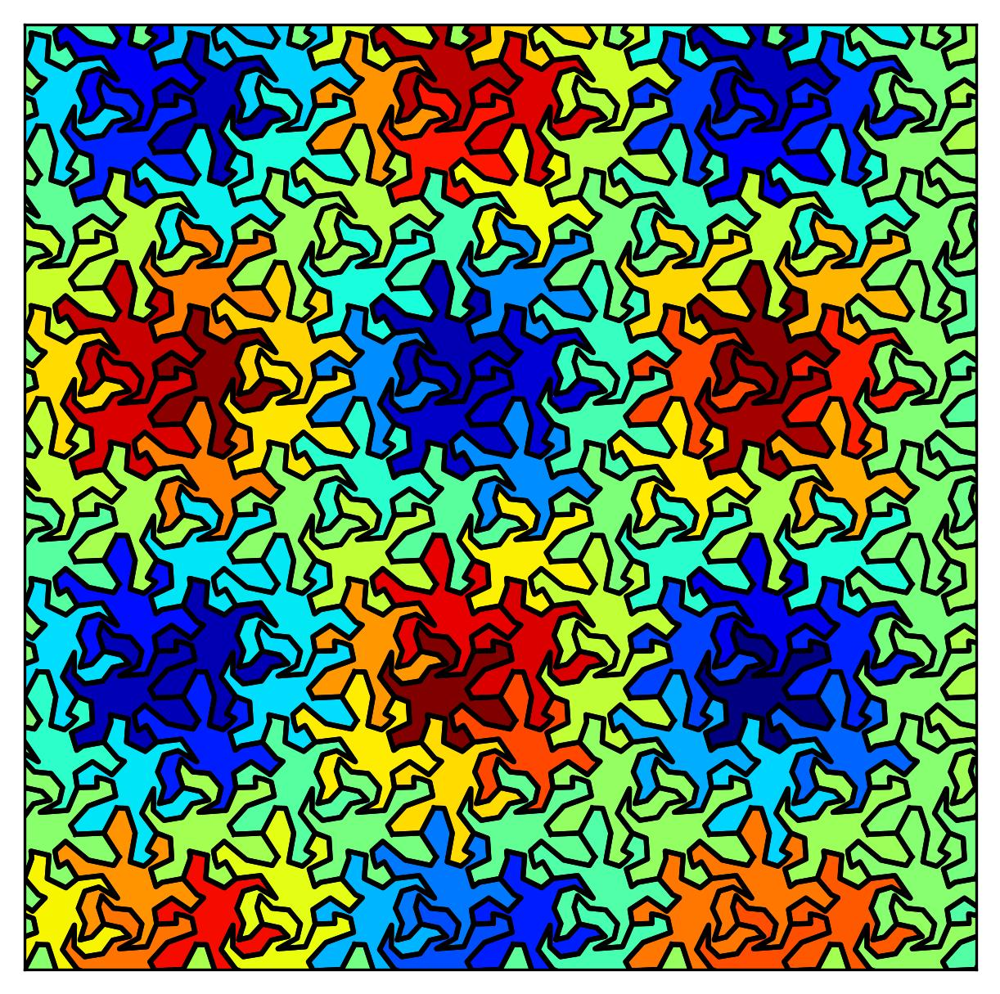
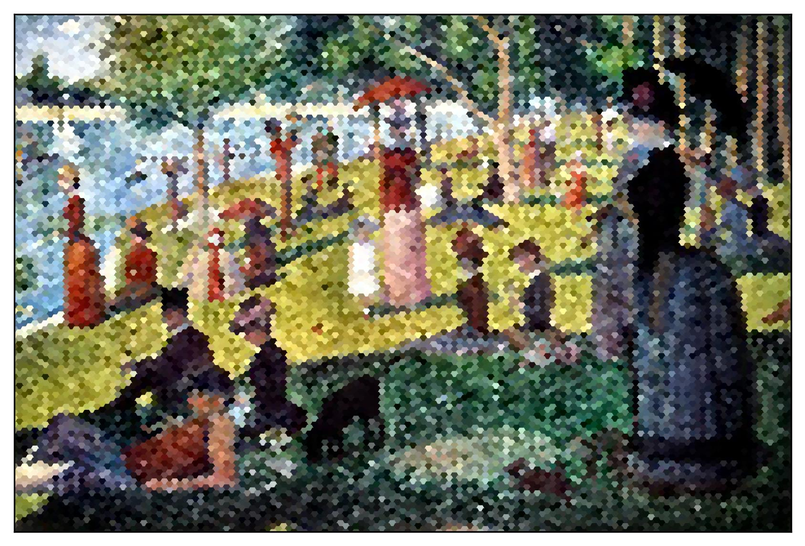

# Crazybin

You think [hexbin](https://matplotlib.org/stable/api/_as_gen/matplotlib.pyplot.hexbin.html) plots are a fancy way to visualize your data? Well, you can go much further... Check out Crazybin to bring your histograms to a whole new level!

Want an example? What about this double sine distribution visualized in the form of [reptiles](https://en.wikipedia.org/wiki/Reptiles_(M._C._Escher)) by [M. C. Escher](https://en.wikipedia.org/wiki/M._C._Escher)?

```python
import numpy as np
import matplotlib.pyplot as plt
from crazybin import crazybin

x=np.linspace(0,10,100)
y=np.linspace(0,10,100)
x,y=np.meshgrid(x,y)
x=x.ravel()
y=y.ravel()
weights=np.sin(x)*np.cos(y)

crazybin(x,y,weights, tile='reptile', cmap='jet', gridsize=4, edgecolor='black')
plt.show()
```



Crazybin provides two top-level methods: `crazybin` is the counterpart of [matplotlib.hexbin](https://matplotlib.org/stable/api/_as_gen/matplotlib.pyplot.hexbin.html). `imshow` is similar to [matplotlib.imshow](https://matplotlib.org/stable/api/_as_gen/matplotlib.pyplot.imshow.html). For example, with `imshow`, you can easily turn [Pointillism](https://en.wikipedia.org/wiki/Pointillism) into 'Hexillism'!

```python
import numpy as np
import matplotlib.pyplot as plt
from crazybin import imshow

image=plt.imread('images/grande_jatte_seurat.jpg')/255
imshow(image, tile='hex', gridsize=150)
plt.show()
```



## Usage
`crazybin` and `imshow` are (more or less) drop-in replacements of `matplotlib.hexbin` and `matplotlib.imshow`. For detailed information, check out their doc-strings. See also the examples in the [examples folder](./examples/).
```python
from crazybin import crazybin, imshow
```
Crazybin can also be used in an object oriented style. See [Custom Tiles](#tile-object).

## Tiles
Possible keywords for the `tile` argument are:
### Regular Tiles
- "hex": Regular hexagon
- "hex_rhomb": Composition of a regular hexagon, triangles and rhombs/squares.
- "reptile": Composition of three lizard shaped tiles inspired by M.C. Escher
- "frog": Composition of four frog shaped tiles inspired by M.C. Escher.

### Irregular Tiles
- "pen_rhomb": P3 penrose tiling, consisting of two rhombs with different angles.

### Custom Tiles
#### Via JSON File
Regular tiles can be read from files with `json` format. `v1` and `v2` contain the lattice vectors, defining the translation directions of the tiles. Each tile consists of one or more 'atoms', which are arbitrary shapes which make up the tile.
<details>
  <summary>Example JSON for a hexagon</summary>

```json
{
    "v1": [
        1.5000000000000002,
        0.8660254037844379
    ],
    "v2": [
        5.551115123125783e-17,
        1.7320508075688774
    ],
    "atoms": [
        [
            [
                -0.49999999999999994,
                0.8660254037844387
            ],
            [
                -1.0,
                2.1460752085336256e-16
            ],
            [
                -0.5000000000000002,
                -0.8660254037844385
            ],
            [
                0.49999999999999994,
                -0.8660254037844387
            ],
            [
                1.0,
                -6.031855794721673e-16
            ],
            [
                0.5,
                0.8660254037844387
            ],
            [
                -0.49999999999999994,
                0.8660254037844387
            ]
        ]
    ]
}
```
</details>


JSON files can be specified by providing a filename with `.json` extension to the tile keyword arguments.
```python
imshow(image, tile='path/to/hex.json', gridsize=150)
```

#### Tile Object
Grids consist of `Tile` objects, which can be instantiated from a list of `shapely.Polygon` objects. For a regular parquet, you need to specify two grid vectors via a `Grid` object, defining the translations of the tiles. 
```python
import numpy as np
from shapely import Polygon
import matplotlib.pyplot as plt
from crazybin import Tile, Grid, TileImage, RegularParquetFactory
grid=Grid([0,1],[1,0])
tile=Tile([Polygon([(0,0), (1,0), (1,1), (0,1)])])
fac=RegularParquetFactory(tile, grid)
image=np.random.rand(10,10)
im=TileImage(image, fac, gridsize=10)
im.plot()
plt.show()
```

## Credits
The implementation of the penrose tiling generator was inspired by [this blog article](https://preshing.com/20110831/penrose-tiling-explained/). The "reptile" and "frog" patterns were inspired by [this](https://www.geogebra.org/m/CUdKaHeC#material/vnb3vpsy) and [this](https://www.geogebra.org/m/CUdKaHeC#material/pzjk5fru) [Geogebra tesselation projects](https://www.geogebra.org/m/CUdKaHeC). Artist images were taken from Wikipedia.

</img> </img> </img>